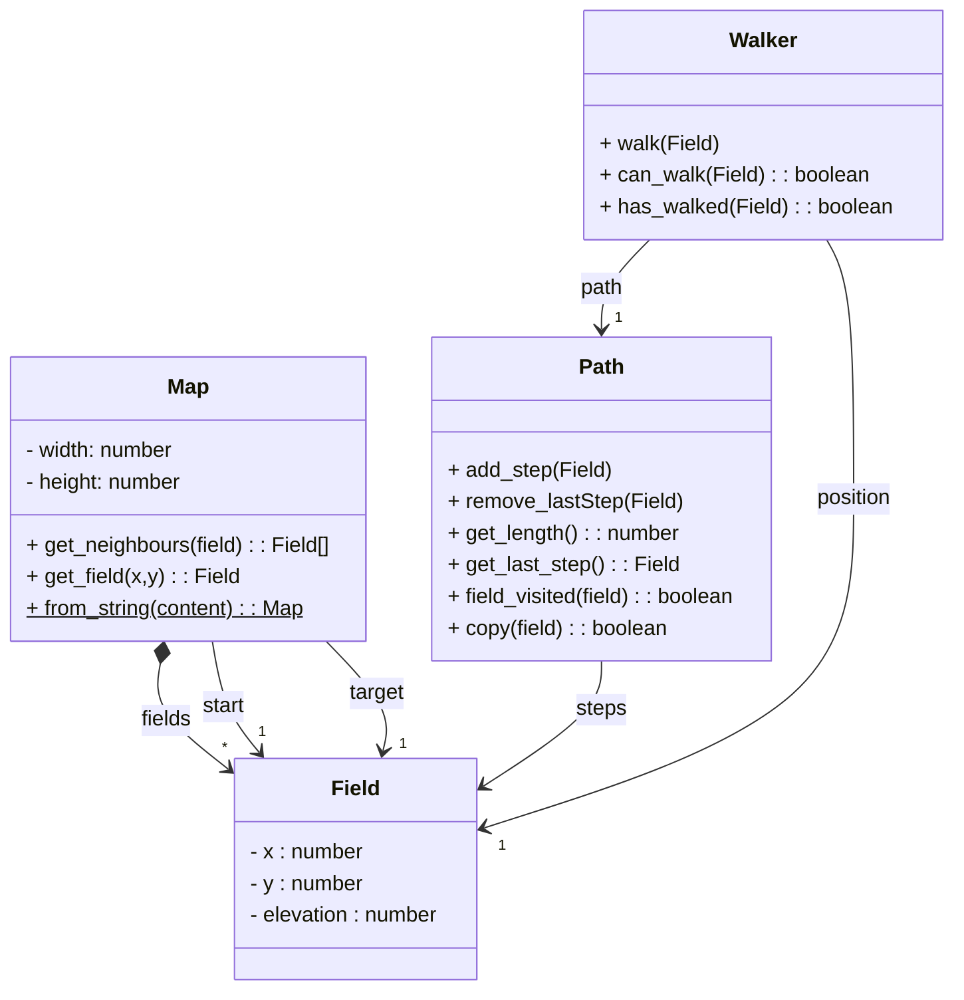

# hillclimber.python

## getting started

- install dependencies using `pip3 install -r requirements.txt`
- run tests by running `python3 -m pytest -v`
  - note that the `-v` attribute will show printed lines (if you need some debugging-information)

###
```
.
├── README.md             this file
├── requirements.txt      the dependencies used in this project
├── src                   source code
│   └── model.py          the model classes
└── tests                 test code
    └── test_model.py     model test code
```

## Class Diagram

## Task
--- Day 12: Hill Climbing Algorithm ---
You try contacting the Elves using your handheld device, but the river you're following must be too low to get a decent signal.

You ask the device for a heightmap of the surrounding area (your puzzle input). The heightmap shows the local area from above broken into a grid; the elevation of each square of the grid is given by a single lowercase letter, where a is the lowest elevation, b is the next-lowest, and so on up to the highest elevation, z.

Also included on the heightmap are marks for your current position (S) and the location that should get the best signal (E). Your current position (S) has elevation a, and the location that should get the best signal (E) has elevation z.

You'd like to reach E, but to save energy, you should do it in as few steps as possible. During each step, you can move exactly one square up, down, left, or right. To avoid needing to get out your climbing gear, the elevation of the destination square can be at most one higher than the elevation of your current square; that is, if your current elevation is m, you could step to elevation n, but not to elevation o. (This also means that the elevation of the destination square can be much lower than the elevation of your current square.)

For example:
```
Sabqponm
abcryxxl
accszExk
acctuvwj
abdefghi
```
Here, you start in the top-left corner; your goal is near the middle. You could start by moving down or right, but eventually you'll need to head toward the e at the bottom. From there, you can spiral around to the goal:
```
v..v<<<<
>v.vv<<^
.>vv>E^^
..v>>>^^
..>>>>>^
```
In the above diagram, the symbols indicate whether the path exits each square moving up (^), down (v), left (<), or right (>). The location that should get the best signal is still E, and . marks unvisited squares.

This path reaches the goal in 31 steps, the fewest possible.

What is the fewest steps required to move from your current position to the location that should get the best signal?
