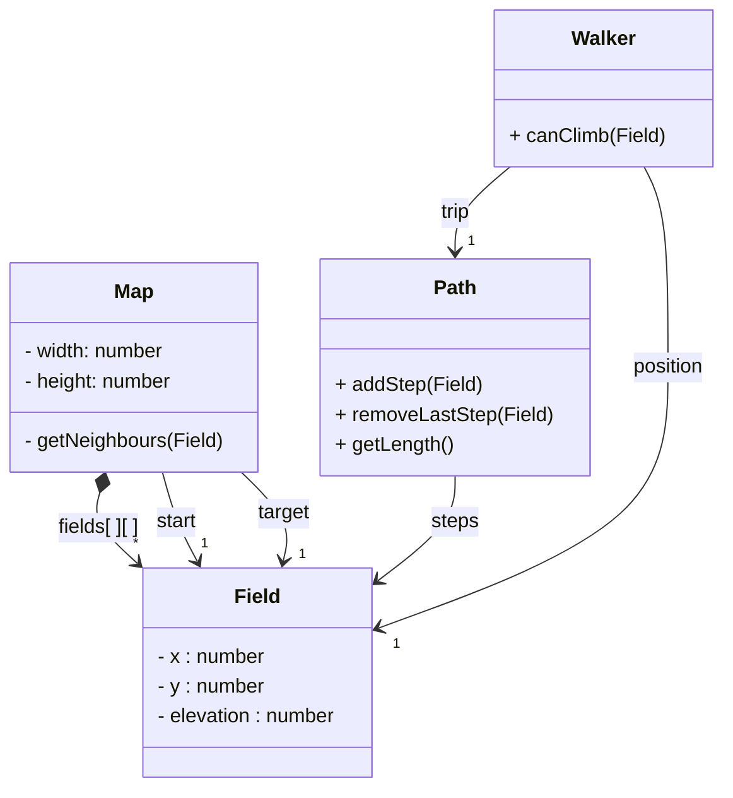

# hillclimber.python

```mermaid
classDiagram
class Map {
  - width: number
  - height: number
  - getNeighbours(Field)
}
Map *--> "*" Field : fields[ ][ ]
Map --> "1" Field : start
Map --> "1" Field : target

class Field {
  - x : number
  - y : number
  - elevation : number
}

class Path {
  + addStep(Field)
  + removeLastStep(Field)
  + getLength()
}
Path --> Field : steps

class Walker {
  + canClimb(Field)
}
Walker --> "1" Field: position
Walker --> "1" Path: trip
```
